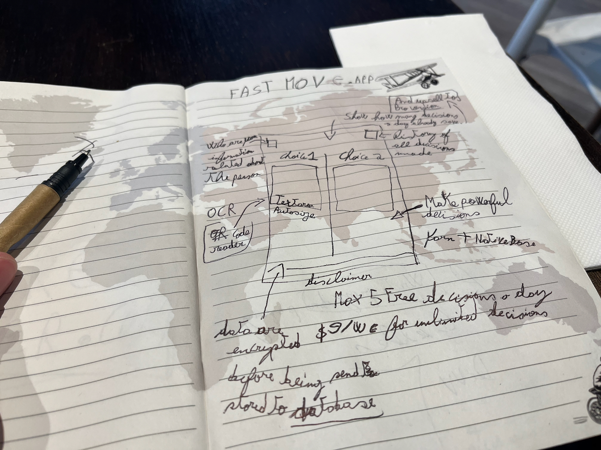

# 💨 FastMove™ Smart Decision Maker

## Take less decisions by having your AI clone doing the crucial job for you 😌

**Make the right choices! Be happier and more energized by taking less decisions**

FastMove is a React Native app, built with TypeScript 5 and Yarn 4. This mobile app uses NativeBase for the UI 🚀

### Requirements

Use the versions declared in `package.json`: Node 20.14.0 and Yarn 4.2.2. The Yarn executable is bundled in `.yarn/releases/`; no global Yarn upgrade is needed.

### First Run 🚀

1. Install dependencies without changing the lockfile: `node .yarn/releases/yarn-4.2.2.cjs install --immutable`.
2. Copy `.env.dist` to `.env` and review the configuration.
3. Start the development server: `node .yarn/releases/yarn-4.2.2.cjs start`.

This is an unfinished prototype. The type check currently fails on the OCR implementation, environment declarations, a dialog ref, and leftover house types. The AI service expects a different key name from the template, parses unvalidated model text, and would embed a provider key in the client bundle. Do not put a production provider key in this app; an authenticated backend is needed before distribution. Saving a decision also needs an awaited write and a stable ID before history deletion is reliable.

Use `node .yarn/releases/yarn-4.2.2.cjs ts:check` and `node .yarn/releases/yarn-4.2.2.cjs prettier:check` to review the current state. The existing native build scripts use legacy Expo commands and have not been validated with the current SDK.

### Cleanup Code

1. Verify if the code syntax follows the Prettier rules `yarn prettier:check`
2. To fix the indentation/code styling `yarn prettier:fix`

## The Cook

**[Pierre-Henry Soria](https://pierrehenry.dev)**. A passionate, mission-driven product software engineer! 😊 I’m also a true cheese 🧀, dark chocolate 🍫, and espresso ☕ lover! 😋

[![@phenrysay][x-badge]](https://x.com/phenrysay "Follow Me on X") [![@pH7Programming][yt-badge]](https://www.youtube.com/@pH7Programming/videos "YouTube Tech Videos") [![@pierrehenry][substack-badge]](https://substack.com/@pierrehenry "Subscribe to my Substack") [![pH-7][github-badge]](https://github.com/pH-7 "My GitHub profile")

### Project Prototype of FastMove

## License

Generously distributed under the [MIT license](https://opensource.org/license/mit/).

<!-- GitHub's Markdown reference links -->

[x-badge]: https://img.shields.io/badge/X-000000?style=for-the-badge&logo=x&logoColor=white
[yt-badge]: https://img.shields.io/badge/YouTube-FF0000?style=for-the-badge&logo=youtube&logoColor=white
[substack-badge]: https://img.shields.io/badge/Substack-Dummy?style=for-the-badge&logo=substack&logoColor=white
[github-badge]: https://img.shields.io/badge/GitHub-100000?style=for-the-badge&logo=github&logoColor=white
